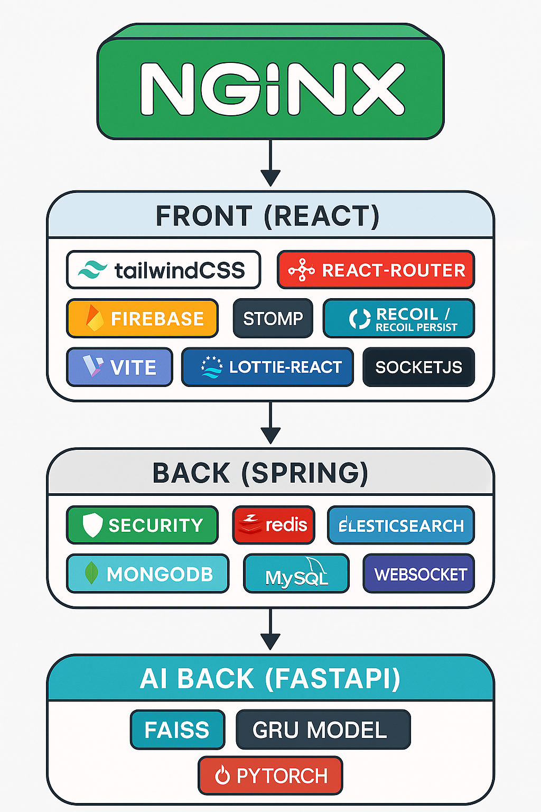
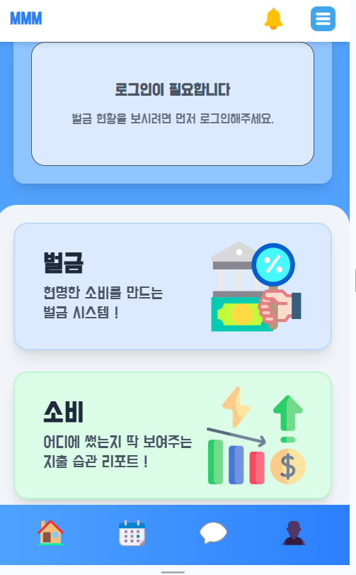
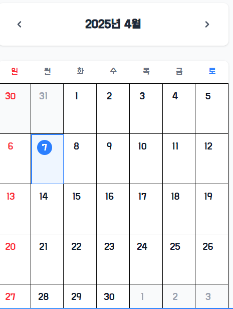
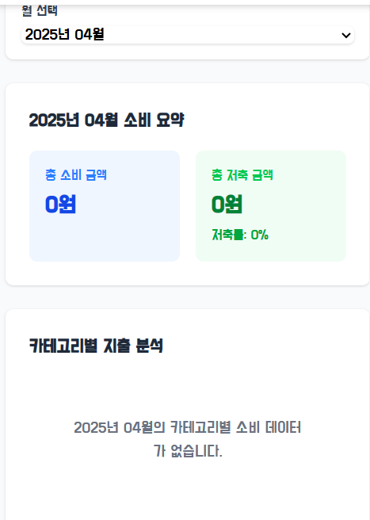
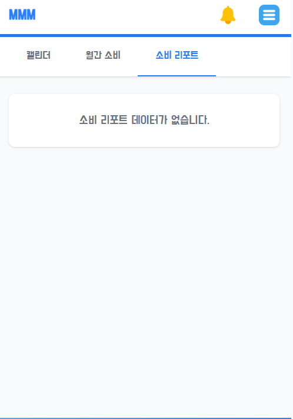
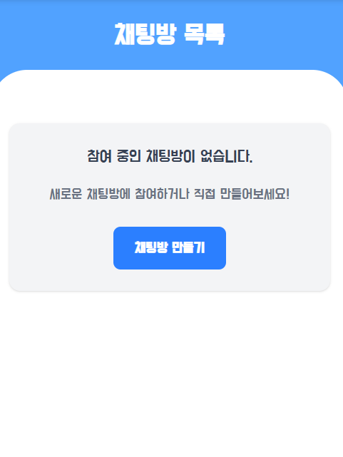
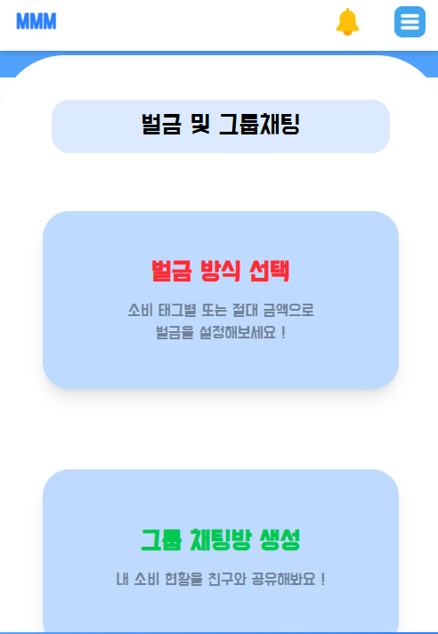

# 💰 프로젝트: MMM (무조건 모으는 머니)

> **“과소비의 시대, 소비습관을 바꾸는 작은 실천부터”**  
> 습관성 소비를 인식하고, 절약을 실천하는 현대인을 위한 소비 분석 & 저축 가이드 서비스

---

## 🧠 문제 인식

현대인 대부분은 수입 대비 과도한 소비를 경험하고 있습니다.  
특히 **과시 소비, 모방 소비**가 사회 전반으로 확산되며, **습관적 소비**가 일상화되고 있습니다.

📌 참고 기사  
- 📈 [현대인 85% "소비 수준 높아져…과시·모방소비 증가 탓"](https://www.newsis.com/view/NISX20230310_0002221562)  
- 👜 ["돈 없어도 샤넬백·오마카세 질러요"…눈 높아진 이유 있네](https://www.hankyung.com/article/202303109492g)

---

## 🎯 프로젝트 목적

**MMM (무조건 모으는 머니)** 는  
과소비 성향이 있는 현대인들이 **자신의 소비 패턴을 인식**하고,  
**습관적인 저축과 소비 절제를 실천**할 수 있도록 돕는 서비스입니다.

### ✅ 주요 기능
- 📊 **소비 분석**: 카테고리별 소비 내역 분석
- 🔍 **소비 패턴 인식 & 연령대 비교**: 유사 연령대 소비 성향 매칭
- 🧠 **AI 기반 다음 달 소비 예측**: GRU 모델 기반 시계열 예측
- 💸 **맞춤형 저축 가이드 & 카드 추천**

---

## 📅 개발 기간
- 2025.02.17 ~ 2025.04.12 (총 6주)

---

## 🛠️ 사용 기술 스택

### 💻 Backend

### 🎨 Frontend

### 🧠 AI / ML

### 🚀 DevOps / CI·CD

---

## 👥 팀원 소개

| 이름 | 역할 | GitHub |
|------|------|--------|
| 최종민 | Leader / Full Stack | [@ocsba0821](https://github.com/ocsba0821) |
| 신우진 | Back End / AI | [@zebra0345](https://github.com/zebra0345) |
| 강건준 | Front End | [@kang-geon-jun](https://github.com/kang-geon-jun) |
| 황학선 | Back End | [@HHS-97](https://github.com/HHS-97) |
| 박찬미 | Back End / CI·CD | [@chaaaaaaanmi](https://github.com/chaaaaaaanmi) |
| 박성욱 | Front End | [@sungwook22](https://github.com/sungwook22) |

---

## 🔁 서비스 흐름도

- **NGINX** → React Front → Spring Back → FastAPI AIBack 구조
- 각 단계는 모듈화되어 있으며, 세션인증과 AI 예측이 통합되어 있습니다.

---

## 🖼️ 주요 화면 구성

### 🏠 메인 화면  

- 웹 어플리케이션을 기준으로 화면 구성(400 x 642)
- 메인에 벌금이 얼마나 쌓였는지, 벌금과 저축으로 들어가는 화면구성
- 상단에 메인화면으로 돌아가는 버튼, 알림, 탭 버튼
- 하단부 홈, 캘린더, 채팅방, 내정보 버튼

### 📆 캘린더 화면  

- 캘린더 화면에 고정지출 내용 추가
- 각 날마다 소비내역 한눈에 확인 할 수 있는 기능 지원
- 소비내역 확인으로

### 📈 월간 리포트  

- 월간 소비내역 카테고리별 분류
- 소비 요약으로 어떤 카테고리에 얼마나 소비했는지 요약 기능 제공

### 🤖 소비 리포트  

- 사용자의 소비 기반 AI의 소비데이터 분석결과 제공
- 연령대별 분류 -> 어떤 연령대에 가까운지 분석
- 소비 데이터를 분석하여 다음달의 소비내역 예측

### 💬 커뮤니티 채팅방  

- 채팅방 기능 제공
- 거지방 아이디어에 착안하여 서로 절제하는 습관 공유, 팁 공유 하는 커뮤니티
- 하루에 벌금 얼마 썼는지 각 사용자별 제공하여 서로간의 소비 내역 공유

### ⚙️ 초기 벌금 설정  

- 벌금 방식, 채팅방 생성 화면으로 나뉨
- 벌금 방식은 소비 태그별 벌금 / 절대금액 벌금 으로 나뉨
- 소비 태그별로 몇퍼센트씩 벌금 / 절대금액에 반올림하여 벌금
- 벌금을 통해 사용자는 과소비하는 습관을 줄이고 벌금 현황을 보며 자신이 얼마나 소비했는지 파악할 수 있음
---
## 🤖 AI 기술스택
- 데이터 전처리 작업
  - 자동 태그 기능
    - 가게 이름 기반 자동 태그 분류 기능 FastAPI에서 제공
    - 소상공인 가게 이름 + 소상공인 협의회 기준 태그 분류 데이터 수집
    - 대한민국에 등록된 거의 전체의 상가 데이터 수집(2천만개 이상)
    - Kobert 모델로 가게 이름 토큰화
    - 토큰화된 데이터 압축 -> FAISS 인덱스화
    - bin 데이터화로 가게 이름을 코사인 유사도 기반 자동 태그 작업 완료(시간복잡도 O(1))
  - 시계열 데이터 수집
    - 사용자의 소비내역 전체 수집
    - 시계열 데이터를 많이 만들기 위한 sliding window 기법
    - 3개월 데이터를 1, 2, 3 / 2, 3, 4 /... 3개월 단위로 한 사용자의 데이터를 4개가 아니라 여러개로 만들어서 데이터 증강
    - 학습률 조정, 파라미터 조정으로 정확도 68 -> 95% 까지 상승
      - 코사인 유사도 거리, 평균 표준 오차, 평균 절대 오차, 평균 절대 백분율 오차 등 도입
- FastAPI 측에서는 이 과정을 통해 완성된 모델을 불러와서 사용

## 🧾 팀 회고

