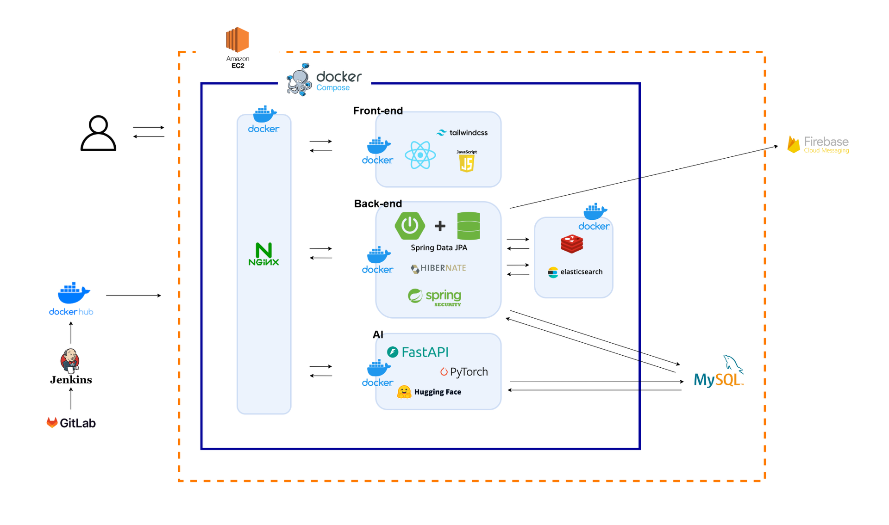

# 박찬미 - TIL

## 2025. 3. 4.
### 영속성 컨텍스트
영속성 컨텍스트는 서버와 데이터베이스 사이에 엔티티를 저장하는 환경으로, 엔티티를 저장하거나 조회하면 엔티티 매니저는 영속성 컨텍스트에 엔티티를 보관하고 관리한다.

**영속성 컨텍스트 이점**
- 1차 캐시
- 동일성(`==`) 보장
- 트랜잭션을 지원하는 쓰기 지연
- 변겅 감지

## 2025. 3. 5.
### 특화 프로젝트 기획
**의사소통의 중요성** <br>
- 팀 미팅 진행 후 팀원들과 피드백을 바탕으로 기획에 대한 의견을 나누었는데, 같은 기능을 다르게 생각하고 있는 경우도 있었고, 이해를 하지 못하고 있는 경우도 있었다.
- 이러한 상황을 기획 단계에서 미리 겪음으로써 본격적인 프로젝트에 들어갈 때 좀 더 정확한 설명과 많은 의사소통의 필요성을 느꼈다.

## 2025. 3. 6.
### 세션 (Session)
서버가 사용자의 상태를 유지하는 방식으로, 세션 ID를 통해 사용자를 관리한다.

**장점**
- 보안성: 사용자 정보가 서버에 저장되어 있어 JWT보다 보안성이 높다.
- 제어 용이성: 서버에서 세션을 관리하기 때문에 사용자의 로그인 상태를 쉽게 제어할 수 있다.

**단점**
- 서버 부하: 세션 정보를 서버에 저장해야 하므로, 사용자가 많아질수록 서버 부하가 증가한다.
- 확장성 제한: 서버 환경이 확장될 경우 세션 관리가 복잡해질 수 있다.

**세션 기반 인증 흐름**
1. 사용자(클라이언트)가 서버에 로그인 요청
2. 서버는 인증 절차를 수행하고, 인증이 유효하면 세션 객체를 생성하고 서버에 저장
3. 서버는 요청에 대한 응답으로 응답헤더의 `set-cookie`를 통해 세션 ID를 클라이언트에게 전달
4. 이후 클라이언트가 서버에 요청할 때마다 전달 받은 쿠키를 요청헤더에 추가하여 요청
(쿠키를 요청헤더에 추가해주는 것은 브라우저가 처리해줌)

### JWT (Json Web Token)
JSON 객체를 사용하여 사용자의 정보를 안전하게 전송하는 방법이다. 토큰 자체에 정보를 담고 있어 별도의 인증 저장소가 필요하지 않다.

**구성요소**
- `Header`: 토큰의 유형(JWT)과 해싱 알고리즘 정보를 담는다.
- `Payload`: 사용자 식별자, 발행자, 유효 기간 등의 클레임 정보를 담는다.
- `Signature`: 서버의 비밀키로 해시하여 생성된 서명으로, 토큰의 무결성과 유효성을 보장한다.

**장점**
- 무상태(Stateless): 서버가 사용자의 상태를 저장하지 않기 때문에 서버 부하를 줄일 수 있다.
- 확장성: 다수의 서버나 다양한 도메인 간 통신에 유용하다.

**단점**
- 보안 취약성: 토큰이 탈취되면 정보가 노출될 수 있으며, 유효 기간이 길거나 만료되지 않으면 리스크가 증가한다.

**JWT 인증 흐름**
1. 사용자(클라이언트)가 서버에 로그인 요청
2. 서버는 인증 절차를 수행하고, 인증이 유효하면 Base64로 인코딩된 JWT를 클라이언트에게 발급
3. 사용자(클라이언트)는 요청 시 요청 헤더의 `Authorization`에 발급 받은 JWT를 “`Bearer JWT Token`” 형식으로 담아서 보냄
4. 서버는 전달 받은 JWT를 검증하고 응답
(JWT에는 요청한 사용자의 정보가 담겨있어 DB를 조회하지 않고 사용자를 식별할 수 있음)

**Refresh Token**<br>
JWT는 발급된 토큰을 만료 전까지 무효화할 수 없다는 단점이 있다. 이를 해결하기 위한 방법으로 `Refresh Token`을 도입할 수 있다.<br>
`Refresh Token`은 `Access Token` 만료시 `Access Token`을 재발급 해주는 역할을 한다.<br>
`Access Token`의 유효 시간을 짧게 설정하여 보안을 강화하고, `Refresh Token`은 유효 시간을 길게 설정하여 `Access Token` 만료시 재발급해주며 빈번한 로그인 과정을 없앨 수 있다.

## 2025. 3. 7.
### 상속관계 매핑
- 관계형 데이터베이스는 상속 관계 X
- 슈퍼타입 서브타입 관계라는 모델링 기법이 객체 상속과 유사
- 상속관계 매핑: 객체의 상속과 구조와 DB의 슈퍼타입 서브타입 관계를 매핑

**슈퍼타입 서브타입 논리 모델을 실제 물리 모델로 구현하기**
- 각각 테이블로 변환 ⇒ 조인 전략
- 통합 테이블로 변환 ⇒ 단일 테이블 전략
- 서브타입 테이블로 변환 ⇒ 구현 클래스마다 테이블 전략

## 2025. 3. 10.
### ERD 설계
**식별관계**<br>
부모 테이블의 기본키를 자식 테이블의 기본키로 사용하는 관계이다.<br>
부모 테이블의 키가 자식의 기본키에 포함되기 때문에 반드시 부모 테이블에 데이터가 존재해야 자식 테이블에 데이터를 입력할 수 있다. 즉, 부모 데이터가 없다면 자식 데이터는 생길 수 없다.<br>
ERD에서 실선으로 표시된다.

**비식별관계**<br>
부모 테이블의 기본키를 자식 테이블의 기본키로 사용하지 않고, 외래키로 사용하는 관계이다.<br>
ERD에서 점선으로 표시된다.

## 2025. 3. 11.
### 도커
도커(Docker)는 컨테이너 기반의 가상화 플랫폼으로, 응용 프로그램과 그 종속성을 격리된 환경인 컨테이너로 패키징하여 실행하는 기술이다. 이를 통해 응용 프로그램을 서로 다른 환경에서도 일관되게 실행할 수 있고, 개발 환경과 운영 환경 사이의 차이로 인한 문제를 줄일 수 있다. 도커 컨테이너는 가볍고 빠르며 확장성이 좋아서 개발 및 배포 프로세스를 간소화하는데 사용된다.

**도커를 사용하는 이유**
- 환경 일치성<br>
다양한 환경에서 동일한 실행 환경을 보장한다. 개발 환경과 운영 환경의 차이로 인한 문제를 방지하며, 응용 프로그램을 어디서든 실행할 수 있다.
- 편리한 배포<br>
도커 컨테이너는 이미지로 패키징되어 배포되므로, 어플리케잇녀 배포가 간단해진다. 이미지를 공유하거나 배포할 때 용이하며, 빠른 확장이 가능하다.
- 격리된 환경<br>
도커는 각 컨테이너를 격리된 환경으로 실행하므로, 하나의 컨테이너에서 발생한 문제가 다른 컨테이너에 영향을 주지 않는다.
- 자원 효율성<br>
가상 머신과 비교해 더 가볍고 빠르며, 호스트 시스템의 리소스를 효율적으로 활용할 수 있다.
- 스케일링<br>
컨테이너 기반 아키텍처는 쉬운 스케일링이 가능하며 요구에 따라 응용 프로그램을 확장할 수 있다.

**도커 구성요소**
- `Docker Engine`: 컨테이너 실행을 담당하는 핵심 엔진
- `이미지(Image)`: 컨테이너 실행을 위한 패키지
- `컨테이너(Container)`: 이미지를 실행한 독립적인 환경
- `Docker Hub`: 도커 이미지를 공유할 수 있는 저장소
- `Docker Compose`: 여러 개의 컨테이너를 한 번에 실행하고 관리하는 도구

## 2025. 3. 12.
### 배포 과정
코드 작성 → 빌드 → 컨테이너화(Docker) → 배포(AWS) → 운영(NginX, CI/CD)

1. 코드 변경 → GitLab 푸시
2. Jenkins 자동 빌드 시작 → React & Spring Boot 빌드
3. Docker 이미지 생성 → EC2에서 직접 실행할 컨테이너 생성
4. AWS EC2 서버 배포
5. NginX 설정
6. 자동화된 CI/CD → 코드가 변경될 때마다 Jenkins가 자동으로 빌드 및 배포

## 2025. 3. 13.
### MobaXterm
SSH 설정을 포함하여 다양한 네트워크 프로토콜을 지원하는 툴

### SSH
네트워크 상의 다른 컴퓨터에 로그인하거나 원격 시스템에서 명령을 실행하고 다른 시스템으로 파일을 복사할 수 있도록 해주는 응용 프로그램 또는 프로토콜

## 2025. 3. 14.
### 정규화, 반정규화

| 구분      | 정규화                                       | 반정규화                                  |
|----------|-------------------------------------------|------------------------------------------|
| 목적      | 데이터 중복 제거 및 무결성 유지              | 성능 최적화 및 조회 속도 향상             |
| 데이터 중복 | 최소화                                     | 허용 (데이터 일관성을 위해 추가적인 관리 필요) |
| 테이블 수  | 증가                                       | 감소                                    |
| 조인 연산  | 조회 시 증가하지만, 데이터 일관성 유지 용이 | 조회 시 감소하지만, 데이터 중복으로 관리 복잡 |
| 쓰기 연산  | 단순 (중복 데이터 없음)                     | 복잡 (중복 데이터 동기화 필요)             |
| 적용 상황  | 데이터 일관성이 중요한 경우 (금융, 의료)     | 조회 성능이 중요한 경우 (로그, 분석 시스템)  |

<br>
공통 프로젝트 때는 깊이 고민하지 않고 ERD를 설계했고, 개발에 들어가고 나서야 팀원들이 설계시 고민하고 토론했던 부분을 이해할 수 있었다. 그래서 이번엔 ERD를 설계하면서 팀원들과 성능적인 부분에 대해 의견을 나누고, 왜 이렇게 설계되는지 이해하기 위해 노력하고 있다.

## 2025. 3. 17.
### HTTP -> HTTPS 리디렉션
**HTTP (Hyper Text Transfer Protocol)**<br>
- 서버/클라이언트 모델을 따라 데이터를 주고 받기 위한 프로토콜
- 80번 포트 사용

**HTTPS (Hyper Text Transfer Protocol Secure)**<br>
- HTTP에 데이터 암호화가 추가된 프로토콜
- 네트워크 상에서 중간에 제3자가 정보를 볼 수 없도록 암호화 지원
- 443번 포트 사용

**리디렉션 이유**
- 보안 강화
- 검색 엔진 최적화 (SEO)
- 사용자 경험 개선
- 규제 준수

## 2025. 3. 18.
### 도커 컴포즈
도커 컴포즈는 단일 서버에서 여러 개의 컨테이너를 하나의 서비스로 정의해 컨테이너의 묶음으로 관리할 수 있는 작업 환경을 제공하는 관리 도구이다.<br>
YAML 파일(`docker-compose.yml`)을 통해 여러 컨테이너의 설정을 정의하고, 단일 명령어로 모든 컨테이너를 생성 및 실행할 수 있다.<br>
도커 컴포즈는 `docker run` 명령어를 여러 개 모아놓은 것과 같다.

**커맨드**<br>
- `up` 커맨드는 `docker run` 과 비슷하다.
정의 파일에 기재된 내용대로 이미지를 내려받고 컨테이너를 생성 및 실행한다.
- `down` 커맨드는 컨테이너와 네트워크를 정지 및 삭제한다. 이때 볼륨과 이미지는 삭제하지 않는다.
만약 컨테이너와 네트워크를 삭제 없이 종료만 하고 싶다면 `stop` 커맨드를 사용한다.

**컴포즈 파일 작성**<br>
- version: 컴포즈 파일의 버전
- services: 컨테이너 정의
- networks: 네트워크 정의
- volumes: 볼륨 정의

## 2025. 3. 19.
### 도커 컴포즈 .env 파일을 제대로 가져오지 못하는 문제
**문제 원인**<br>
`.env` 파일이 Windows 형식(CRLF)으로 작성되어 있어 Unix 형식(LF)로 인식되지 않아서 발생

**문제 해결**
- dos2unix 명령어를 사용하여 Windows 형식의 파일을 Unix 형식으로 변환
    ```bash
    dos2unix <.env 경로>
    ```
    - 변환이 정상적으로 되었는지 확인
        ```bash
        dos2unix -v <.env 경로>
        ```
        “converting file” 메시지를 출력하면 정상적으로 변환된 것
        
- 파일 직접 확인 및 수정<br>
    `nano`나 `vim`으로 열어보고 `$`나 줄 끝에 이상한 문자가 있는지 점검한 후 수동 저장
    
- `docker-compose down && docker-compose up -d` 를 통해 Docker 컨테이너 재시작

**왜 Unix 형식이어야 하는가**<br>
Unix 형식 (LF)의 `.env` 파일이 Docker와 Linux 기반 시스템에서 제대로 인식된다.<br>
Windows 형식 (CRLF)의 `.env` 파일은 Docker 컨테이너나 Linux 서버에서 제대로 처리되지 않는 경우가 많다.<br>
Unix 시스템에서는 줄바꿈을 `LF`(Line Feed, `\n`)로 처리한다.<br>
Windows 시스템에서는 줄바꿈을 `CRLF`(Carriage Return + Line Feed, `\r\n`)으로 처리한다.<br>
Docker는 컨테이너 내에서 Linux 기반 환경을 사용하므로, Windows 형식으로 작성된 .env 파일은 제대로 인식되지 않거나, 줄 끝에 불필요한 문자가 추가되어 오류를 일으킬 수 있다.

## 2025. 3. 20.
### Docker out of Docker
컨테이너 내부에서 호스트의 Docker 데몬을 사용하는 방식
- 데몬<br>
백그라운드에서 계속 실행되며 특정 서비스를 제공하는 프로세스이다.<br>
Docker 데몬은 Docker API 요청을 수신하고 컨테이너, 이미지, 네트워크 등 Docker 객체를 관리한다. 사용자는 Docker CLI를 통해 명령을 Docker 데몬에 전달하고, 데몬이 이를 처리한다.

**문제 발생**<br>
docker-compose 가 실행될 때마다 젠킨스 컨테이너에 Docker CLI를 설치해줘야 하는 문제

**문제 원인 - 컨테이너의 휘발성**<br>
도커 컨테이너는 상태를 유지하지 않도록 설계되어 재시작/재생성 시 수동 설치한 소프트웨어가 사라진다.

**문제 해결**<br>
이미지 빌드 시점에 Docker CLI를 설치하고, 호스트의 Docker 소켓을 사용하여 재설치 없이 계속 Docker 기능을 사용할 수 있도록 했다.

## 2025. 3. 21.
### CI/CD
**CI(Continue Intergration)**
- 개발자가 코드를 변경할 때마다 자동으로 빌드 및 테스트 수행
- 코드 변경이 있을 때마다 자동으로 테스트를 실행하므로, 코드 품질을 유지할 수 있다.

**CD(Continuous Deployment/Continuous Delivery)**
- Continuous Delivery (지속적인 제공)
    - 테스트를 통과한 코드를 배포 준비 상태로 만들어 놓는다.
    - 실제 배포는 사람이 결정하여 진행한다.
    - 배포 준비를 자동으로 끝내주고, 배포 여부는 사람이 결정한다.
- Continuous Deployment (지속적인 배포)
    - 테스트를 통과한 코드를 자동으로 프로덕션 환경에 배포한다.
    - 사람이 개입하지 않아도 배포가 이루어진다.
    - 테스트만 통과하면 자동으로 사용자에게 전달된다.

### Jenkins
Jenkins는 지속적인 통합(CI)과 지속적 배포(CD)를 자동화하는 오픈소스 도구이다.

## 2025. 3. 24.
그동안 Stream API를 사용해 한 번에 데이터를 변환하고 가져오는 방식으로 코드를 작성해왔는데, 오늘 기능을 구현하면서 불필요한 조회와 데이터 변환이 많다는 걸 느꼈다. 그래서 for문과 Stream API의 성능 차이에 대해 찾아보았다.

### for문
- 단순한 반복 작업: 데이터를 단순히 순회하거나, 특정 조건에 따라 반복을 중단해야 할 때
- 인덱스를 활용해야 할 때: 배열이나 리스트의 인덱스를 직접 사용해야 하는 경우
- Stream API의 오버헤드가 부담되는 경우: 작은 데이터셋을 처리할 때는 Stream API의 오버헤드가 상대적으로 크기 때문에 for문이 더 효율적일 수 있다.

### Stream API
- 병렬 스트림 활용 가능: parallelStream()을 통해 대량의 데이터를 병렬로 처리할 수 있다. 이는 CPU 코어를 최대한 활용하여 성능을 높일 수 있다.
- 데이터 변환이 많을 때: map, filter, flatMap 등의 연산자를 체인으로 연결하여 복잡한 데이터 변환을 간결하게 처리할 수 있다.
- 가독성이 중요할 때: 함수형 프로그래밍 스타일로 코드를 작성할 때

## 2025. 3. 25.
### @Transactional
`@Transactional` 애노테이션을 사용하면 Spring은 해당 메서드에 대한 트랜잭션 관리를 자동으로 처리한다.<br>
트랜잭션은 데이터베이스의 상태를 일관성 있게 유지하고, 여러 연산이 모두 성공하거나 모두 실패하는 것을 보장한다. 예를 들어, 메서드 내에서 예외가 발생하면 해당 트랜잭션을 롤백하여 데이터의 무결성을 보장한다.

**`@Transactional(readOnly = true)`**<br>
이 속성을 통해 트랜잭션을 읽기 전용 모드로 설정할 수 있다.

**readOnly = true 속성 사용 시 이점**
- 성능 최적화<br>
읽기 전용 모드로 설정하면 데이터베이스는 쿼리와 캐싱을 최적화할 수 있다. 또한, 데이터 변경 감지를 위한 스냅샷 저장이 생략되어 메모리 사용량이 줄어든다.
- 데이터 무결성 보장<br>
의도치 않게 데이터가 변경되는 것을 방지하여 데이터 무결성을 유지할 수 있다.
- 코드 가독성 향상<br>
해당 속성이 설정된 메서드는 데이터를 읽기만 한다는 것을 명확히 알 수 있다.

## 2025. 3. 26.
### @AuthenticationPrincipal
`Spring Security`에서 사용자의 인증 정보를 컨트롤러 메서드의 파라미터로 간편하게 주입받을 수 있도록 도와주는 어노테이션이다. 이 어노테이션은 `Authentication.getPrincipal()`의 값을 자동으로 바인딩하며, 현재 인증된 사용자 정보를 쉽게 사용할 수 있다.<br>
`Spring Security`는 인증 정보를 `SecurityContextHolder`를 통해 관리한다. 이 컨텍스트에서 `Authentication` 객체를 가져올 수 있으며, `Authentication.getPrincipal()` 메서드를 통해 현재 인증된 사용자의 정보를 얻는다. `@AuthenticationPrincipal`은 이 과정을 간소화하여 컨트롤러 메서드에서 직접 사용자의 정보를 받을 수 있도록 한다.

## 2025. 3. 27.
### elasticsearch
분산형 검색 및 분석 엔진으로, 대량의 데이터를 빠르게 검색하고 분석할 수 있는 오픈소스 솔루션이다.
- 기존 RDBMS(MySQL, MariaDB 등)는 데이터가 많아질수록 조회 성능이 저하될 수 있다.
- Elasticsearch는 검색에 특화된 엔진으로, 빠른 검색과 필터링이 가능하다.
- `Inverted Index(역색인)` 구조를 사용해 텍스트 검색 속도가 뛰어나다.
- 대량의 데이터도 빠르게 조회할 수 있어 성능 최적화가 가능하다.

## 2025. 3. 28.
### actuator
애플리케이션의 모니터링과 관리를 위한 기능을 제공하는 라이브러리다.

**주요 엔드포인트**
- `/actuator/health`: 애플리케이션 상태 확인
- `/actuator/info`: 앱 관련 정보 출력

## 2025. 3. 31.
### Atomic Design
UI 구성 요소를 체계적으로 관리하기 위해 고안된 디자인 방법론으로, 화면을 작은 단위로 나누고 이를 조합하여 사용자 인터페이스를 설계하는 방식이다.<br>
Atoms(원자), Molecules(분자), Organisms(유기체), Templates(템플릿), Pages(페이지) 5단계로 구성된다.

- Atoms<br>
가장 작은 단위의 구성 요소로, 버튼, 입력 필드, 레이블 등 기본 HTML 요소와 색상, 폰트 같은 추상적 스타일을 포함한다. 독립적이고 재사용성이 높다.
- Molecules<br>
여러 원자가 결합하여 하나의 목적을 가진 작은 UI 그룹을 형성한다. 예를 들어, 레이블가 입력 필드, 버튼이 결합된 검색 폼이 이에 해당한다.
- Organisms
분자와 원자가 결합된 더 복잡한 UI 구성 요소로, 헤더나 카드 목록처럼 명확한 영역과 콘텍스트를 가진다.
- Templates<br>
유기체들을 배치하여 페이지의 구조를 설계하는 단계이다. 콘텐츠는 포함되지 않으며 레이아웃만 정의한다.
- Pages<br>
템플릿에 실제 데이터를 넣어 최종 사용자에게 보여지는 완성된 화면을 만든다.

<br>

**장점**<br>
- 재사용성 극대화: 작은 단위부터 설계하여 컴포넌트를 여러 곳에서 재활용할 수 있다.
- 일관성 유지: 체계적인 구조를 통해 디자인과 개발 간의 일관석을 확보한다.
- 효율적인 협업: 디자이너와 개발자가 동일한 컴포넌트를 기반으로 작업하여 협업이 용이하다.

**단점**<br>
- 작업 시간이 늘어나고 일부 컴포넌트가 지나치게 복잡해질 수 있다.

## 2025. 4. 1.
### 리액트 - 전역 상태 관리
리액트에서 전역 상태 관리는 애플리케이션의 여러 컴포넌트가 데이터를 공유하고 일관되게 업데이트할 수 있도록 돕는 중요한 개념이다. 이를 통해 Prop Drilling(상위 컴포넌트에서 하위 컴포넌트로 props를 계속 전달하는 문제)을 해결하고, 코드 복잡성을 줄일 수 있다.

- React Context API
    - 리액트에 내장된 기능으로, 간단한 전역 상태 관리에 적합하다.
    - 장점: 별도의 라이브러이 없이 사용 가능하며 설정이 간단하다.
    - 단점: 상태 변경 시 모든 관련 컴포넌트가 리렌더링되어 성능 문제가 발생할 수 있다.
- Redux
    - 가장 오래된 전역 상태 관리 라이브러리로, 중앙 저장소(Store)를 통해 상태를 관리한다.
    - 장점: 대규모 애플리케이션에 적합하여 강력한 미들웨어와 디버깅 도구 제공
    - 단점: 설정 과정이 복잡하고 보일러플레이터 코드가 많다.
- Zustand
    - 경량화된 상태 관리 라이브러리로, 간단한 API와 빠른 성능을 제공한다.
    - 장점: 불필요한 리렌더링을 최소화하며 사용법이 직관적이다.
    - 단점: 대규모 프로젝트에서는 기능이 제한적일 수 있다.
- Recoil
    - React 팀이 개발한 라이브러리로, 원자적 상태 관리(Atomic State)를 지원한다.
    - 장점: 컴포넌트별로 독립적인 상태 관리 가능
    - 단점: 비교적 새로운 도구로 커뮤니티와 자료가 적다.

## 2025. 4. 2.
### QueryDSL
QueryDSL은 타입 안전한 동적 쿼리 작성을 지원하는 Java 기반 프레임워크로, 주로 JPA와 함께 사용된다.
기존 JPQL이나 Criteria API처럼 문자열로 쿼리를 작성하는 방식에서 발생할 수 있는 오류를 컴파일 시점에 방지하고, 더 객체지향적인 방식으로 쿼리를 작성할 수 있다.

**특징**
- 타입 안정성: 자바 코드로 SQL 또는 JPQL 쿼리를 작성하며, 컴파일 시점에 문법 오류를 확인할 수 있다.
- 동적 쿼리 작성: 조건에 따라 유연하게 쿼리를 생성할 수 있어 복잡한 쿼리 작성에 용이하다.
- 다양한 데이터 저장소 지원: JPA뿐만 아니라 MongoDB, SQL 등 다양한 저장소에서도 사용할 수 있다.

**장점**
- 문법 오류 방지: 컴파일 시점에 오류를 확인할 수 있어 런타임 에러를 줄일 수 있다.
- 가독성 및 재사용성: 메서드 추출을 통해 쿼리 조건을 재사용할 수 있다.
- 복잡한 쿼리 처리: 다중 테이블 조인, 조건부 검색 등 복잡한 작업도 간결하게 구현 가능하다.

**단점**
- 러닝 커브가 존재하며, 초기 설정과 학습이 필요하다.
- JPA 1차 캐시를 활용하지 못해 성능 최적화에 주의가 필요하다.

## 2025. 4. 3.
### async, await
- `async`: 함수 앞에 붙여 해당 함수를 비동기 함수로 만든다. 비동기 함수는 항상 Promise를 반환하며, 반환된 값은 자동으로 resolve 된다.
- `await`: Promise가 완료될 때까지 기다린 후 결과를 반환한다. `await`은 반드시 `async` 함수 안에서만 사용할 수 있다.

## 2025. 4. 4.
### Interceptor
인터셉터(Interceptor)는 `Axios`에서 제공하는 기능으로, HTTP 요청이나 응답을 가로채고 처리할 수 있는 매커니즘이다. 이를 통해 요청 전후 또는 응답 전후에 추가 작업을 수행하거나 데이터를 수정할 수 있다.

**요청 인터셉터**
```javascript
axios.interceptors.request.use(
  (config) => {
    // 요청 전에 토큰 삽입
    const token = localStorage.getItem('accessToken');
    if (token) {
      config.headers.Authorization = `Bearer ${token}`;
    }
    return config;
  },
  (error) => {
    return Promise.reject(error);
  }
);
```

**응답 인터셉터**
```javascript
axios.interceptors.response.use(
  (response) => {
    // 응답 데이터 가공
    return response;
  },
  (error) => {
    // 공통 에러 처리
    if (error.response?.status === 401) {
      alert('다시 로그인 해주세요');
      // router.push('/login') 등 처리 가능
    }
    return Promise.reject(error);
  }
);
```

## 2025. 4. 7.
### @PathVariable
- URL 경로 자체에 포함된 값을 추출할 때 사용
- URL 경로에 의미가 있는 경우에 사용
- RESTful 설계에서 자원(리소스)을 식별할 때 주로 사용
- 직관적이고 깔끔
```java
@GetMapping("/daily-report/{date}")
public ResponseEntity<?> getReport(@PathVariable LocalDate date) {}
```

- `@DateTimeFormat(iso = DateTimeFormat.ISO.DATE)`<br>
    - 문자열을 날짜 객체(LocalDate 등)로 자동 변환하기 위한 포맷 지정
    ```java
    @PathVariable @DateTimeFormat(iso = DateTimeFormat.ISO.DATE) LocalDate date
    ```
    - 클라이언트가 `2025-04-07` 같은 형식으로 날짜를 보내면 Spring이 이걸 LocalDate 타입으로 변환해준다.
    - 포맷은 ISO 형식 (`yyyy-MM-dd`)을 쓰겠다는 의미

### @RequestParam
- 쿼리 스트링(파라미터) 값을 추출할 때 사용
- 필터링, 정렬, 검색 조건 등 부가 정보를 넘길 때 사용
- 선택적인 값도 쉽게 처리 가능(`required = false`)
- 여러 조건을 조합해서 넘기기 좋음(`/search?keyword=food&type=title&page-2`)
```java
@GetMapping("/daily-report")
public ResponseEntity<?> getReport(@RequestParam LocalDate date) {}
```

## 2025. 4. 8.
### axios 메서드 구조
- `axios.get(url, config)`
- `axios.post(url, data, config)`
- `axios.put(url, data, config)`
- `axios.delete(url, config)`

## 2025. 4. 9.
### JavaScript - toLocalString()
JavaScript에서 숫자, 날짜, 배열 등의 데이터를 사용자의 로컬 설정에 맞게 형식화된 문자열로 변환하는 메서드

**숫자 포맷팅**
```javascript
const price = 12345678;
const formattedPrice = price. toLocaleString(); // "12,345,678"
```

## 2025. 4. 10.
### 아키텍처
시스템의 구조와 동작 원리를 설계하는 청사진<br>
이번 프로젝트 아키텍처는 `drow.io`를 사용해서 작성했다.
